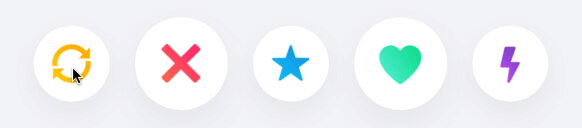
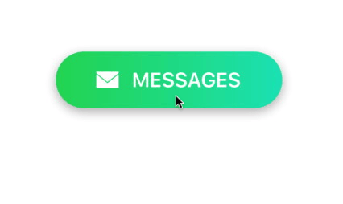

# PopBounceButton
A highly-customizable animated button built with Facebook's Pop animation library. Inspired by the familiar button stack from Tinder.



## Features
* Lightweight and highly customizable
* Animations for multiple UIControlEvents
* Pure Swift 4

## Installation

### CocoaPods
PopBounceButton is available through [CocoaPods](<https://cocoapods.org/>). To install it, simply add the following line to your `Podfile`:

	pod 'PopBounceButton', '~> 1.0'


### Manual
1. Download and drop `PopBounceButton.swift` into your project. 
2. Install Facebook's [Pop](<https://github.com/facebook/pop>) library via CocoaPods by adding the following line to your `Podfile`: 

	    pod 'pop', '~> 1.0'

## Usage

1. Add a `PopBounceButton` to your view.

    ```swift
    let frame = CGRect(origin: .zero, size: CGSize(width: 100, height: 100))
    let button = PopBounceButton(frame: frame)
    view.addSubview(button)
    ```
    
2. To recieve events, conform your class to the protocol `PopBounceButtonDelegate` and set your button's `delegate` property:

    ```swift
    class ViewController: UIViewController, PopBounceButtonDelegate {
    
        override func viewDidLoad() {
            let frame = CGRect(origin: .zero, size: CGSize(width: 100, height: 100))
            let button = PopBounceButton(frame: frame)
            view.addSubview(button)
            
            button.delegate = self
        }
        
        func didTouchUpInside(onButton button: PopBounceButton) {
            print("TouchUpInside recognized.")
        }
        
        func didTouchUpOutside(onButton button: PopBounceButton) {
            print("TouchUpOutside recognized.")
        }
        
    }
    ```

## Customization
Since PopBounceButton is esentially a UIButton wrapper, you can customize your PopBounceButton in the same way you would customize a UIButton (the one exception is adding shadows, see below). You can also customize the animations to suit your specific project needs.

### Animation Settings

Attribute  | Description
|:------------- |:-------------
`springBounciness`  | The effective bounciness of the spring animation. Higher values increase spring movement range resulting in more oscillations and springiness. Defined as a value in the range [0, 20]. Defaults to 19.
`springSpeed`   | The effective speed of the spring animation. Higher values increase the dampening power of the spring. Defined as a value in the range [0, 20]. Defaults to 10.
`springVelocity`   | The initial velocity of the spring animation. Higher values increase the percieved force from the user's touch. Expressed in scale factor per second. Defaults to 6. **NOTE:** This attribute is dependent on the current values for `springBounciness` and `springSpeed`.
`canceDuration`   | The total duration of the scale animation performed after a `touchUpOutside` event is recognized. Expressed in seconds. Defaults to 0.3.
`scaleFactor`   | The factor by which to scale the button after a long-press is recognized. Defaults to 0.7.
`scaleDuration`   | The total duration of the scale animation performed after a long-press is recognized. Expressed in seconds. Defaults to 0.1.
`minimumPressDuration`   | The minimum period fingers must press on the button for a long-press to be recognized. Expressed in seconds. Defaults to 0.2.
 
### Setting a shadow
The only property that cannot be modified directly (via its layer) is the button's shadow. To add a shadow to your PopBounceButton, call the `setShadow` function (see example below). **NOTE:** Modifying the button's shadow directly will have no visible effect.

### Example
The code below produces the following output:



```swift
//Initialize button
let button = PopBounceButton()
button.frame = CGRect(x: 50, y: 100, width: 200, height: 50)
view.addSubview(button)

//Customize animations
button.springSpeed = 15
button.springBounciness = 16
button.springVelocity = 2
button.scaleFactor = 0.9

//Set image and title
button.setImage(#imageLiteral(resourceName: "envelope"))
button.imageView?.contentMode = .scaleAspectFit
button.imageEdgeInsets = UIEdgeInsets(top: 15, left: -12, bottom: 15, right: 0)
button.setTitle("MESSAGES")
button.titleLabel?.font = UIFont.boldSystemFont(ofSize: 18)
button.titleEdgeInsets = UIEdgeInsets(top: 0, left: -70, bottom: 0, right: 0)

//Customize layer
button.layer.cornerRadius = button.frame.height / 2
button.setShadow(radius: 5, opacity: 0.3, offset: CGSize(width: 0, height: 3), color: UIColor.black.cgColor)

//Add gradient layer 
let greenColor = UIColor(red: 39/255, green: 216/255, blue: 91/255, alpha: 1).cgColor
let tealColor = UIColor(red: 30/255, green: 228/255, blue: 188/255, alpha: 1).cgColor
let gradientLayer = CAGradientLayer()
gradientLayer.frame = button.bounds
gradientLayer.colors = [greenColor, tealColor]
gradientLayer.locations = [0.0, 1.0]
gradientLayer.startPoint = CGPoint(x: 0.0, y: 0.5)
gradientLayer.endPoint = CGPoint(x: 1.0, y: 0.5)
button.layer.insertSublayer(gradientLayer, at: 0)   
```

## Requirements
* iOS 8.0+
* Xcode 9.0+

## Sources
* [Pop](<https://github.com/facebook/pop>): Facebook's iOS animation framework.

## Author
Mac Gallagher, jmgallagher36@gmail.com

## License
PopBounceButton is available under the [MIT License](LICENSE), see LICENSE for more infomation.
